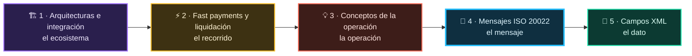
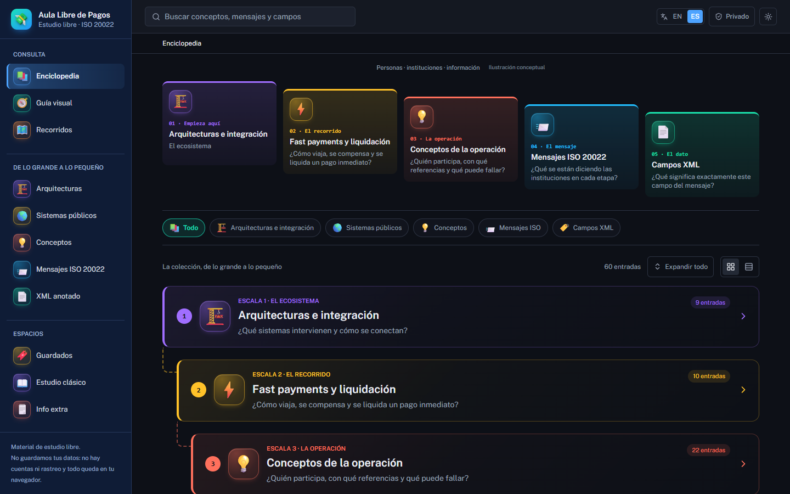
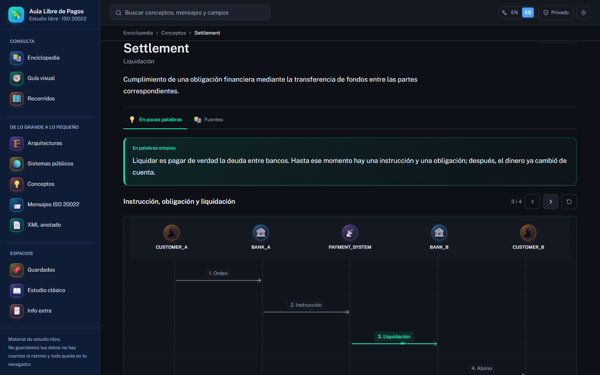
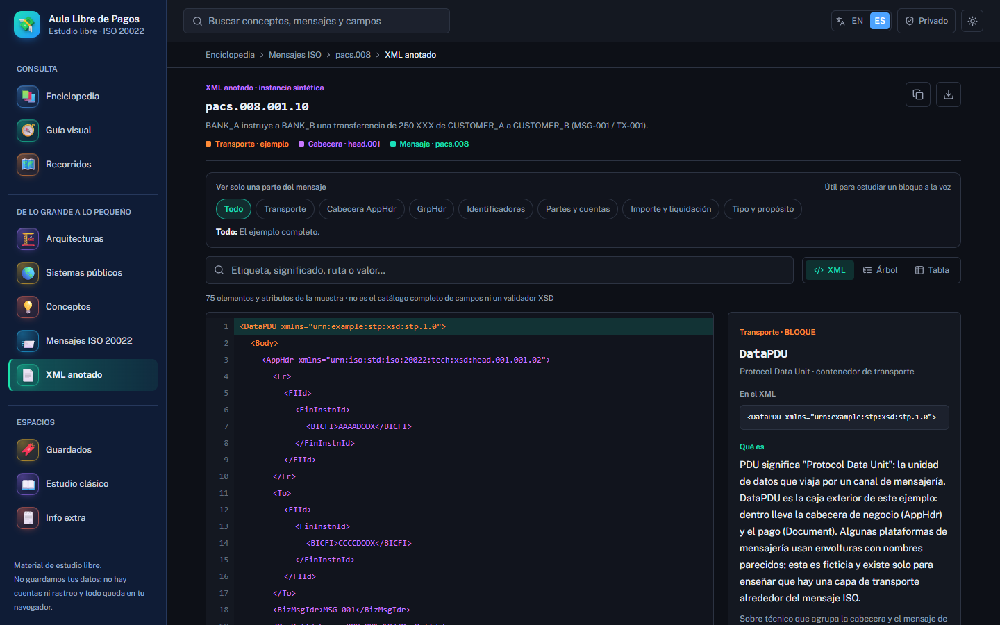
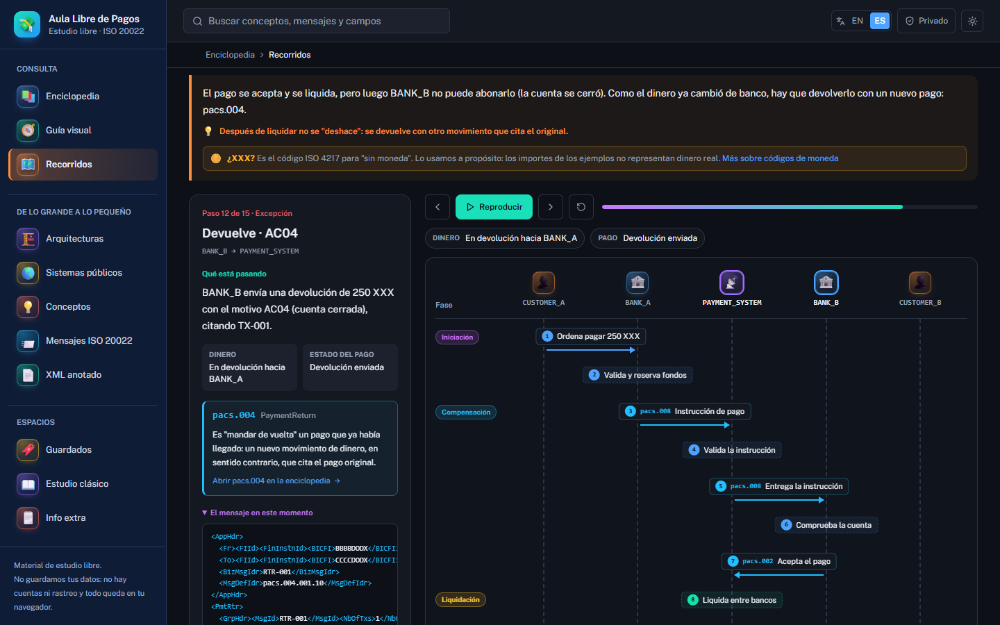
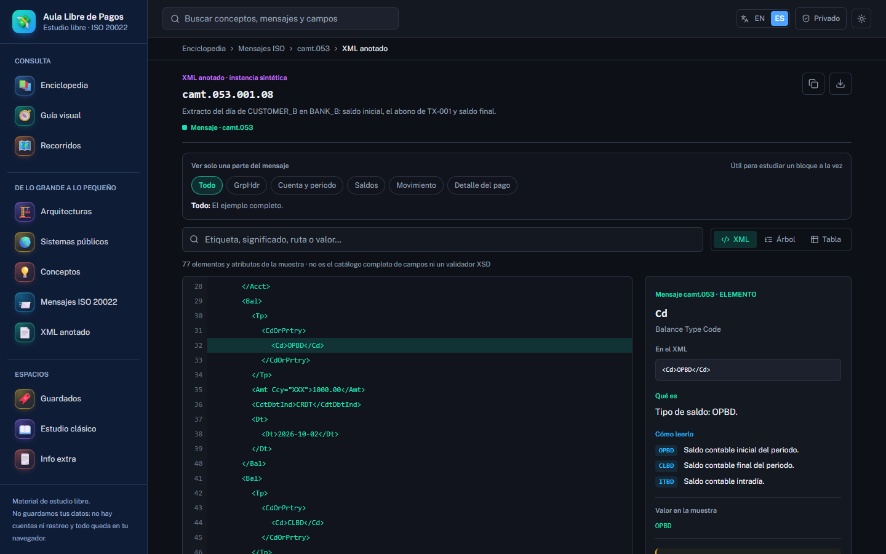
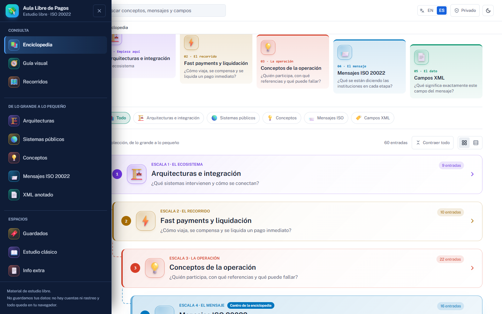
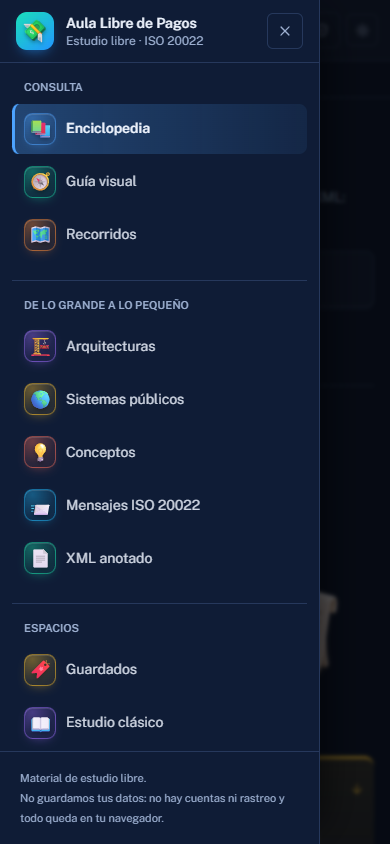

<div align="center">

<a href="https://ejmz216.github.io/payment-lab/"></a>

### Entiende un pago de verdad: del ecosistema completo al último campo del XML.

[](https://ejmz216.github.io/payment-lab/)


[Qué es](#-qué-es) · [Las cinco escalas](#-las-cinco-escalas) · [Qué encuentras](#-qué-encuentras) · [Recorridos](#-un-pago-de-punta-a-punta) · [Capturas](#-capturas) · [XML anotado](#-13-mensajes-con-xml-anotado) · [Desarrollo](#-desarrollo) · [English](#-english)

</div>

---

## 💡 Qué es

**Aula Libre de Pagos** es una enciclopedia interactiva y gratuita para aprender **ISO 20022, sistemas de pago y pagos inmediatos**. No es un manual que se lee de corrido: es un lugar para *ver* cómo se mueve un pago. Quién participa, qué mensajes se envían, en qué orden, qué lleva cada campo del XML y qué pasa cuando algo falla.

<table>
<tr>
<td width="33%" align="center"><br><b>Material de estudio libre</b><br><sub>Abierto, sin registro y sin pagar nada.</sub></td>
<td width="33%" align="center"><br><b>No guardamos tus datos</b><br><sub>Sin cuentas, sin servidor y sin analítica. Tu progreso vive solo en tu navegador.</sub></td>
<td width="33%" align="center"><br><b>Verificado, no inventado</b><br><sub>Los XML se comprueban contra los esquemas oficiales. Todo ejemplo es sintético.</sub></td>
</tr>
</table>

> [!NOTE]
> Todos los ejemplos usan datos ficticios: `BANK_A`, `BANK_B`, `CUSTOMER_A`, `MSG-001`, `TX-001`… Los importes van en **`XXX`**, el código ISO 4217 para *"sin moneda"*, para que ningún ejemplo represente dinero real.

## 🪜 Las cinco escalas

La enciclopedia se recorre **de lo más grande a lo más pequeño**, como una escalera. Los mensajes ISO son su centro.



## 🧭 Qué encuentras

<table>
<tr>
<td width="50%" valign="top">

<b><a href="https://ejmz216.github.io/payment-lab/#/">Enciclopedia</a></b><br>
<sub>60 fichas escritas para aprender: definición, <b>"en palabras simples"</b>, un diagrama interactivo en el tiempo, lo esencial, una analogía con sus límites y un ejemplo.</sub>
</td>
<td width="50%" valign="top">

<b><a href="https://ejmz216.github.io/payment-lab/#/reference/pacs.008?tab=xml">XML anotado</a></b><br>
<sub>Los 13 mensajes con un XML completo. Al tocar cualquier etiqueta ves qué es, cómo leer su valor, "dicho de otra forma" y el error típico. Vistas XML, árbol y tabla.</sub>
</td>
</tr>
<tr>
<td valign="top">

<b><a href="https://ejmz216.github.io/payment-lab/#/recorridos">Recorridos</a></b><br>
<sub>Un pago completo en el tiempo con 7 escenarios: éxito, rechazo, devolución, timeout, cancelación, débito directo y lote de empresa. En cada paso ves el estado del dinero, el del pago y el XML de ese momento.</sub>
</td>
<td valign="top">

<b><a href="https://ejmz216.github.io/payment-lab/#/visual">Guía visual</a></b><br>
<sub>Doce temas como secuencias en el tiempo, con vista de arquitectura cuando aplica.</sub>
</td>
</tr>
<tr>
<td valign="top">

<b>Sistemas públicos</b><br>
<sub>Casos de esquemas públicos explicados solo con material oficial. Nunca se inventa la arquitectura interna de nadie.</sub>
</td>
<td valign="top">

<b>Estudio clásico</b><br>
<sub>La ruta guiada original: lecciones, simulador, laboratorios, práctica y progreso.</sub>
</td>
</tr>
</table>

## 🎬 Un pago de punta a punta

<div align="center">

<br><sub>Así se ven los <a href="https://ejmz216.github.io/payment-lab/#/recorridos">Recorridos</a>, en versión animada. En el sitio puedes pararte en cada paso.</sub>
</div>

Las distinciones que el aula enseña una y otra vez:

| ✋ Esto… | …no es lo mismo que |
|---|---|
| Fondos **reservados** | un **débito** definitivo |
| Mensaje **recibido** | mensaje **aceptado** |
| Pago **aceptado** | pago **liquidado** |
| **Liquidado** entre bancos | **abonado** al beneficiario |
| **Rechazo** (antes de liquidar) | **devolución** (después de liquidar) |
| **ISO 20022** (el idioma) | el **esquema** de pagos (las reglas) |

## 📸 Capturas

<table>
<tr>
<td width="50%"><br><sub><b>La escalera.</b> Cinco escalas, contraídas al abrir.</sub></td>
<td width="50%"><br><sub><b>Una ficha.</b> Palabras simples y un diagrama en el tiempo.</sub></td>
</tr>
<tr>
<td><br><sub><b>XML anotado.</b> Cada etiqueta, explicada.</sub></td>
<td><br><sub><b>Recorridos.</b> El pacs.004 de una devolución, paso a paso.</sub></td>
</tr>
<tr>
<td><br><sub><b>camt.053.</b> El código del saldo, según su contexto.</sub></td>
<td><br><sub><b>Tema claro</b>, con el menú azul marino de marco.</sub></td>
</tr>
</table>

<details>
<summary>📱 <b>Ver en el celular</b></summary>
<br>
<div align="center"></div>
</details>

## 📨 13 mensajes con XML anotado

Cada mensaje tiene una instancia sintética completa. Los mensajes entre bancos **responden al mismo pacs.008** (`MSG-001` / `TX-001` / mismo UETR), así que puedes seguir un pago de un mensaje a otro.

| Familia | Mensaje | Versión | Qué cuenta el ejemplo |
|:--:|---|---|---|
|  | [pain.001](https://ejmz216.github.io/payment-lab/#/reference/pain.001?tab=xml) | `001.10` | Una empresa envía 2 pagos; uno trae un IBAN mal escrito a propósito |
|  | [pain.002](https://ejmz216.github.io/payment-lab/#/reference/pain.002?tab=xml) | `001.11` | El banco acepta en parte y rechaza ese pago con `AC01` |
|  | [pacs.008](https://ejmz216.github.io/payment-lab/#/reference/pacs.008?tab=xml) | `001.10` | La transferencia entre bancos, campo por campo |
|  | [pacs.002](https://ejmz216.github.io/payment-lab/#/reference/pacs.002?tab=xml) | `001.10` | BANK_B acepta el pago (`ACSP`) |
|  | [pacs.004](https://ejmz216.github.io/payment-lab/#/reference/pacs.004?tab=xml) | `001.10` | Devolución por cuenta cerrada (`AC04`) |
|  | [pacs.003](https://ejmz216.github.io/payment-lab/#/reference/pacs.003?tab=xml) | `001.08` | Débito directo con su mandato |
|  | [pacs.028](https://ejmz216.github.io/payment-lab/#/reference/pacs.028?tab=xml) | `001.03` | Preguntar por el estado en vez de reenviar |
|  | [camt.053](https://ejmz216.github.io/payment-lab/#/reference/camt.053?tab=xml) | `001.08` | Extracto: saldo inicial, abono y saldo final |
|  | [camt.054](https://ejmz216.github.io/payment-lab/#/reference/camt.054?tab=xml) | `001.08` | Aviso inmediato del abono |
|  | [camt.056](https://ejmz216.github.io/payment-lab/#/reference/camt.056?tab=xml) | `001.08` | Pedir cancelar un duplicado (`DUPL`) |
|  | [camt.029](https://ejmz216.github.io/payment-lab/#/reference/camt.029?tab=xml) | `001.09` | Cancelación aceptada (`CNCL` / `ACCR`) |
|  | [camt.003](https://ejmz216.github.io/payment-lab/#/reference/camt.003?tab=xml) | `001.07` | Consultar el saldo de liquidación |
|  | [camt.004](https://ejmz216.github.io/payment-lab/#/reference/camt.004?tab=xml) | `001.08` | Respuesta con el saldo actual (`CRRT`) |

## ✅ Verificado, no inventado

- **La estructura de cada XML se comprueba contra los esquemas oficiales.** Los nombres, el orden y los elementos obligatorios se validan con tipos generados de los XSD de ISO 20022. Esa comprobación encontró y corrigió un error real.
- **Los códigos se verifican contra las listas oficiales de ISO 20022:** `AC01`, `AC04`, `DUPL`, `CNCL`, `ACCR`, `OPBD`, `CLBD`, `BOOK`, `CRRT`, `SUPP`…
- **Cada contenido declara qué tipo de afirmación hace:** `REFERENCE`, `SIMPLIFIED MODEL`, `SIMULATION`, `SCHEME DEPENDENT`, `PUBLIC SCHEME`, `TO VERIFY`.
- **ISO 20022, el esquema y el banco son tres cosas distintas.** Lo que dice el estándar no es lo que exige un esquema concreto, y nunca se supone cómo lo implementa una institución.
- **Las 20 pruebas automáticas fallan** si a un campo XML le falta su explicación, si un enlace interno se rompe, si falta una traducción al inglés o si algo se desborda de 320 a 1440 px.

## 🔒 Privacidad

| | |
|---|---|
| 👤 Cuentas | Ninguna |
| 🖥️ Servidor o base de datos | Ninguno: es un sitio estático |
| 📊 Analítica o rastreo | Ninguno |
| 💾 Tu progreso | Solo en `localStorage`, en tu navegador |
| 🕶️ Sesión privada | Un botón que deja de registrar progreso mientras está activo |

> [!WARNING]
> No pegues datos reales de clientes, de producción ni internos de ninguna institución en ningún laboratorio. Usa solo ejemplos sintéticos o públicos. El lienzo compartido de *Info extra* viaja por un relay público (sin retención): úsalo solo para notas públicas o sintéticas.

## 🛠️ Desarrollo

```bash
npm install
npm run dev        # http://localhost:5173/payment-lab/
npm run build      # comprobación de tipos + compilación
npm run preview
```

Pruebas en el navegador (inician o reutilizan el servidor de desarrollo):

```bash
npx playwright install chromium
npm run test:reference
```

> [!TIP]
> En Windows puedes usar el Edge instalado en lugar de descargar Chromium: `PLAYWRIGHT_CHANNEL=msedge npm run test:reference`

Otros comandos:

| Comando | Para qué |
|---|---|
| `npm run icons` | Regenera los iconos Fluent 3D y el favicon a partir de la lista de `scripts/fluent-icons.mjs` |
| `npm run lint` | ESLint |

<details>
<summary>🗂️ <b>Estructura del proyecto</b></summary>

```text
src/
├── content/reference/      Enciclopedia: fichas, escalas, recorridos y ejemplos XML
│   ├── concepts.ts         Conceptos (palabras simples, diagramas, analogías)
│   ├── messageReference.ts Los 13 mensajes ISO
│   ├── journeys.ts         Recorridos de punta a punta
│   └── samples/            XML anotados (*.xml), notas por etiqueta e índice
├── i18n/reference/         Capa en inglés (fichas, XML, recorridos)
├── components/reference/   Explorador XML, diagramas, iconos
├── routes/reference/       Enciclopedia, ficha, guía visual, recorridos
└── styles/                 Paleta semántica, tema claro/oscuro
tests/                      Playwright: búsqueda, XML, diagramas, inglés, anchos
docs/                       Diseño visual, plan y recursos de este README
```

</details>

**Despliegue.** Cada `push` a `main` ejecuta `.github/workflows/deploy.yml`, que compila y publica `dist/` en GitHub Pages. La base de Vite es `/payment-lab/`: cámbiala si el repositorio cambia de nombre.

Más detalles del diseño en [`docs/VISUAL_DESIGN.md`](docs/VISUAL_DESIGN.md), y las reglas de trabajo en [`AGENTS.md`](AGENTS.md).

## 🙏 Créditos

| | |
|---|---|
|  Iconos 3D | [Fluent Emoji](https://github.com/microsoft/fluentui-emoji) de Microsoft, licencia MIT |
| 🔤 Tipografía | [Public Sans](https://public-sans.digital.gov/), SIL Open Font License |
| ✏️ Iconos de interfaz | [Lucide](https://lucide.dev/), licencia ISC |
| 🔍 Verificación de estructuras | Tipos generados de los XSD de ISO 20022 en [moov-io/iso20022](https://github.com/moov-io/iso20022) y [moov-io/fednow20022](https://github.com/moov-io/fednow20022), usados solo como referencia |
| 📚 Fuentes | [Catálogo ISO 20022](https://www.iso20022.org/iso-20022-message-definitions), [BIS · CPMI](https://www.bis.org/cpmi/publ/d154.htm) y material público de los operadores citados en cada ficha |

ISO 20022 es una norma de ISO. Este proyecto la explica con palabras propias y enlaza a las fuentes oficiales; no reproduce sus documentos.

---

## 🌎 English

<details>
<summary><b>Read the summary in English</b></summary>
<br>

**Aula Libre de Pagos** ("Free Payments Classroom") is a free, interactive encyclopedia for learning **ISO 20022, payment systems and instant payments**. It is a static site: no accounts, no server and no tracking. Your progress stays in your browser. The whole site switches between Spanish and English from the header.

- **Encyclopedia.** 60 entries organised as a staircase of five scales: architectures → fast payments → operation concepts → ISO 20022 messages → XML fields. Each entry has a plain-language explanation, an interactive time-sequence diagram, an analogy with its limits and a synthetic example.
- **Annotated XML for all 13 messages:** pain.001/002, pacs.008/002/004/003/028 and camt.053/054/056/029/003/004. Every tag explains what it is, how to read its value and the usual mistake. Structures are checked against types generated from the official XSDs, and codes against the ISO 20022 external code sets.
- **Journeys.** A complete payment over time, from CUSTOMER_A to CUSTOMER_B, in 7 scenarios. Each step shows the money state, the payment state and the XML at that moment.
- **Honest by design.** Every example is synthetic (amounts in `XXX`, the ISO 4217 "no currency" code). Content is labelled as reference, simplified model or scheme-dependent, and no institution's internal implementation is ever inferred.

```bash
npm install && npm run dev
```

</details>

<div align="center">
<br>

<br>
<sub>Hecho con ☕ para estudiar pagos sin pedirle a nadie sus datos.</sub>
<br><br>
<a href="https://ejmz216.github.io/payment-lab/"><b>→ Abrir el aula</b></a>
</div>
